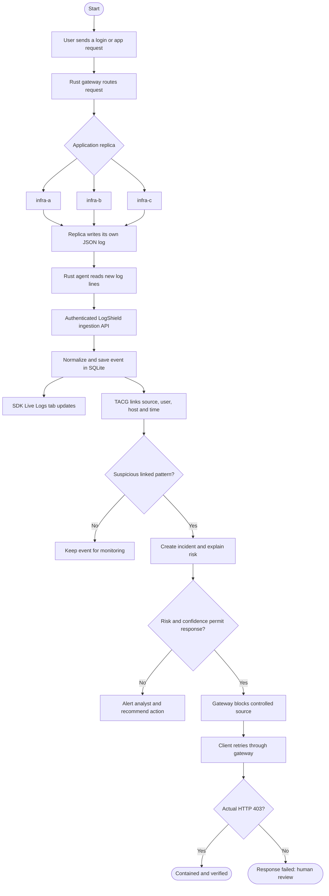

# LogShield workflow

Copy this flowchart to a slide or draw the same boxes and arrows on a sheet. The left browser window sends requests to the controlled application; the right window displays the SDK log stream and investigation.

**Distributed example:** five failed requests from one controlled source reach `infra-a` twice, `infra-b` twice, and `infra-c` once. Every replica stays below a five-failure host threshold. TACG links the agent-delivered logs across all three replicas and creates one explainable incident. A gateway block is considered successful only after a real retry returns HTTP 403.

**Fallback:** the same boxes run on the laptop if the VPS or SSH tunnel is unavailable. Only the dashboard URL changes from port `5174` (VPS tunnel) to port `5173` (local Vite).
